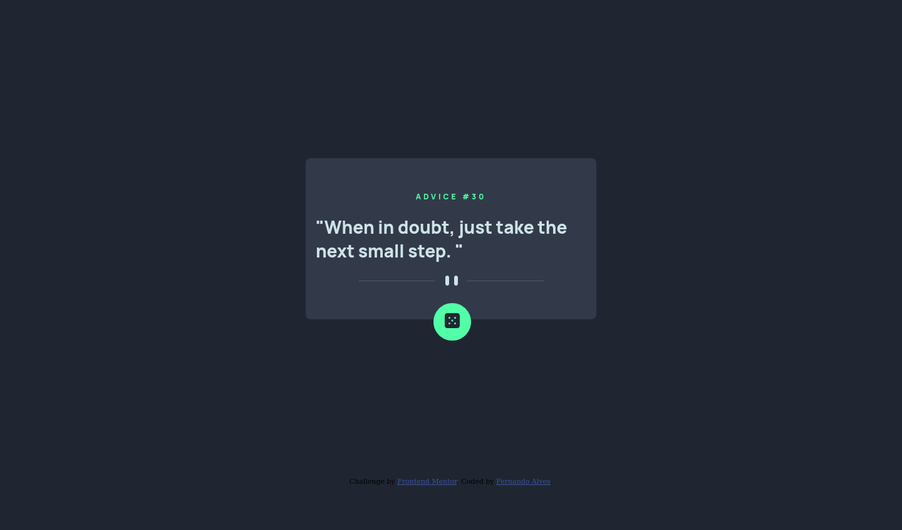

# Frontend Mentor - Advice generator app solution

This is a solution to the [Advice generator app challenge on Frontend Mentor](https://www.frontendmentor.io/challenges/advice-generator-app-QdUG-13db). Frontend Mentor challenges help you improve your coding skills by building realistic projects.

## Table of contents

  - [Overview](#overview)
  - [The challenge](#the-challenge)
  - [Screenshots](#screenshots)
  - [Links](#links)
  - [Built with](#built-with)
  - [What I learned](#what-i-learned)
  - [Author](#author)

## Overview

### The challenge

Users should be able to:

- View the optimal layout for the app depending on their device's screen size.
- See hover states for all interactive elements on the page
- Generate a new piece of advice by clicking the dice icon

### Screenshots

## Mobile

## Desktop

### Links

- Live Site URL: (https://unrivaled-bubblegum-484279.netlify.app/)

### Built with

- Semantic HTML5 markup
- CSS custom properties
- CSS Grid
- Javascript
- Mobile-first workflow

### What I learned

I learned how to get a response from an api, store it in a json object and render it on my webapp using DOM manipulation 

### Author

- Website - [Fernando Alves](https://www.your-site.com)
- Twitter - [@fernandu00](https://www.twitter.com/fernandu00)

